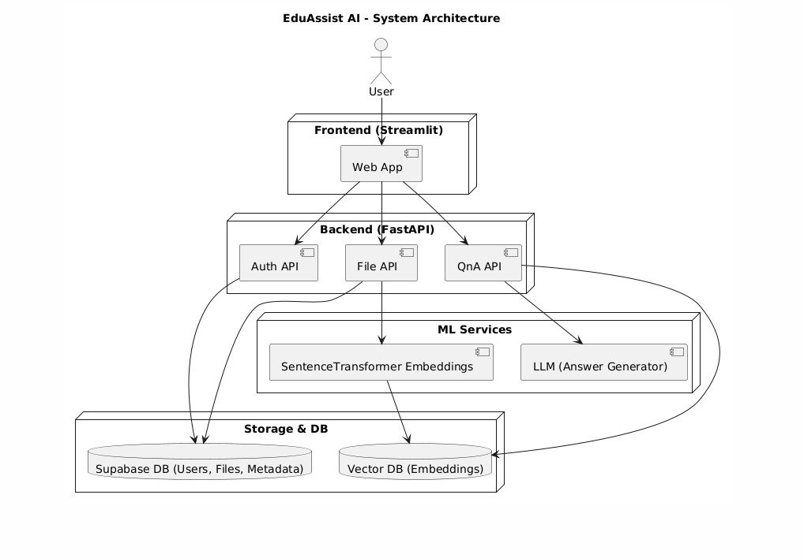
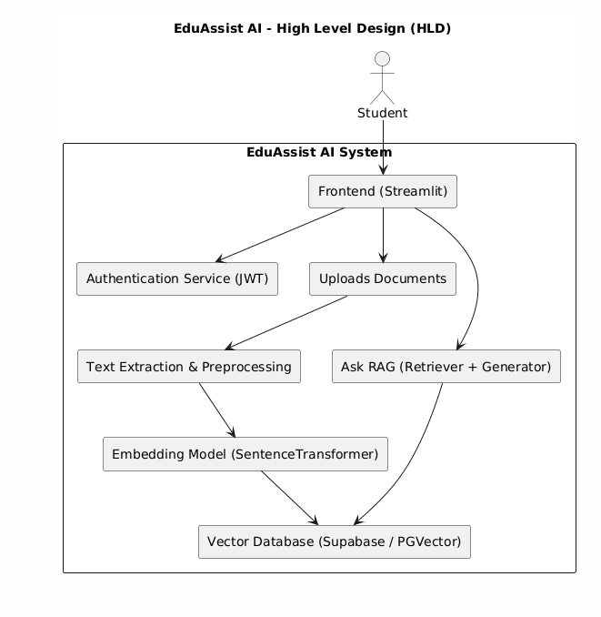
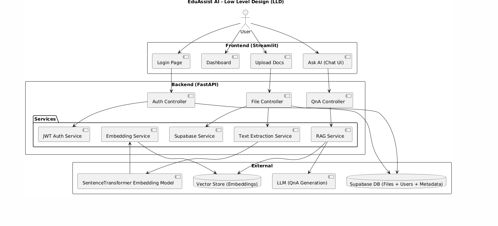

# EduAssist AI: Campus Knowledge Agent 🎓🤖

EduAssist AI is an **AI-powered campus knowledge assistant** that allows students and faculty to **upload, search, query, and manage documents** seamlessly. It leverages **RAG (Retrieval-Augmented Generation)** with Hugging Face embeddings, Supabase storage, and a Streamlit frontend for an easy-to-use interface.

---

## 🚀 Features

- 📂 **Upload & Manage Documents** (stored in Supabase)  
- 🔐 **JWT Authentication & Session Management**  
- 🔎 **Semantic Search** using Hugging Face embeddings  
- ❓ **Q&A over Documents** (Ask your PDFs directly!)  
- 🗑️ **Delete Files** securely with ownership check  
- 🖥️ **Streamlit Frontend** for interactive usage  
- ☁️ **Supabase Backend** for storage + metadata  

---

## 🛠️ Tech Stack

- **Frontend**: [Streamlit](https://streamlit.io/)  
- **Backend**: [FastAPI](https://fastapi.tiangolo.com/)  
- **Database + Storage**: [Supabase](https://supabase.com/)  
- **Embeddings**: Hugging Face (`sentence-transformers/all-MiniLM-L6-v2`)  
- **Auth**: JWT Authentication  
- **Vector Search**: Supabase pgvector  

---

## 📂 Project Structure

```
EduAssist-AI/
│
├── README.md
├── requirements.txt
│
├── backend/
│   └── app/
│       ├── auth.py
│       ├── db.py
│       ├── ingest.py
│       ├── main.py
│       ├── memory.py
│       ├── prompt.py
│       ├── query_llm.py
│       ├── retrieval.py
│       ├── schemas.py
│       ├── utils.py
│
└── frontend/
    ├── app.py
    ├── utils.py
```

---

## ⚙️ Installation & Run

```bash
# Clone Repository
git clone https://github.com/DarshanLoni/campus-knowledge-agent.git
cd campus-knowledge-agent

# Install Dependencies
pip install -r requirements.txt

# Start FastAPI backend
cd src/app
uvicorn main:app --reload

# Start Streamlit frontend
cd ../frontend
streamlit run streamlit_app.py
```

---

## 📊 System Design

### 🏗️ Architecture Diagram


### 🔹 High-Level Design (HLD)


### 🔹 Low-Level Design (LLD)


---

## 🔑 Key Modules

1. **Authentication** → JWT tokens for secure user sessions
2. **File Upload** → Store files in Supabase, keep metadata in DB
3. **Text Extraction** → Extract text from PDFs using PyPDFLoader
4. **Embeddings** → Hugging Face model (`all-MiniLM-L6-v2`)
5. **Vector Search** → Store + search embeddings in Supabase pgvector
6. **RAG Q&A** → Retrieve relevant chunks + answer with LLM
7. **Frontend (Streamlit)** → Simple dashboard for users

---

## 📘 Example Usage

1. **Login/Register**
2. **Upload PDF**
3. **Ask Questions** → *"What is covered in Chapter 3?"*
4. **View/Delete Files**

---

## ✅ Current Phase Completion

- ✅ JWT Authentication
- ✅ Supabase Integration (Storage + DB + pgvector)
- ✅ File Upload & Delete APIs
- ✅ Hugging Face Embeddings + Vector Search
- ✅ RAG-based QnA
- ✅ Streamlit Frontend

---

## 📌 Next Steps (Future Work)

- Add **role-based access control (RBAC)**
- Improve **UI/UX** in Streamlit
- Add **chat memory** for multi-turn QnA
- Enable **real-time notifications** for updates

---

## 👨‍💻 Project Info

**Project Name**: EduAssist AI – Campus Knowledge Agent  
**Authors**: Darshan 
**Stack**: FastAPI, Streamlit, Supabase, Hugging Face, JWT